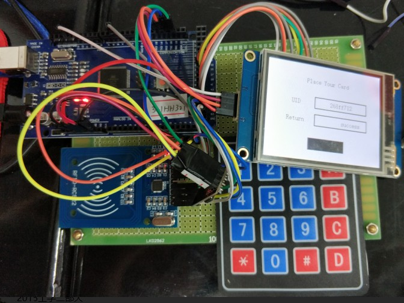

# 无线联网刷卡系统



本仓库代码分为三部分：一部分为HMI的工程文件，一部分为Arduino的联网刷卡库文件，另一部分为[示例页面](http://39.108.7.66:2333/console/)。

详细内容可见设计报告。

## 网站部分
Web页面后台由Django和MongoDB组织，前端采用Semantic-UI。

将Web文件夹下的所有文件全部拷贝至网站根目录下，在命令行窗口中敲入`python manage.py runserver 0.0.0.0:2333`即可运行。运行网址为`0.0.0.0:2333/console/`。

需要注意的是，此网站需要如下的几个python3支持库：

|库名称         |作用             |
|:-------------|:----------------|
|django        |网站后台          |
|simplejson    |json数据解析      |
|pymongo       |MongoDB数据库操作 |

## Arduino库部分
库文件将HMI串口屏和读卡端部分封装为两个类，即`Screen`和`Card`。分别控制屏幕的读写以及读卡端的读卡、构建json数据、上传json数据等操作。

需要注意的是，在`Card`类中的`WIFIInit`函数（`wirelesscard.cpp`文件的95和108行）可根据需要自行更改路由器分配的IP地址范围和服务器地址。

其余详细参数见`wirelesscard.cpp`函数注释。

## 数据上传接口
本系统包含普通用户和管理员用户两个用户组以及刷卡、用户操作等5种模式。

### 模式定义
模式号如下（对应`action`号码）：

|号码|标识                       |说明                        |
|:-:|:--------------------------|:---------------------------|
|0  | user_data                 |  普通用户刷卡模式           |
|1  | new_admin                 |  创建管理员模式             |  
|2  | new_user                  |  创建新普通用户模式         |   
|3  | delete_user_remain_data   |  删除用户但保留用户数据模式  |
|4  | delete_user_without_data  |  删除用户及其全部数据模式    | 

### 错误码定义
服务器返回的错误码定义如下：

|号码 | 说明                                                  |
|:-:  |:-----------------------------------------------------|
|0  | 无错误
|1  | 是POST请求，但是数据处理失败
|2  | 用户不存在
|3  | 管理员uid格式错误或管理员uid前后不等或管理员设置的密码有误
|4  | uid错误或管理员账号或密码错误
|5  | 模式选择错误
|6  | 设备号错误
|7  | 数据结构不完整或错误
|8  | 不是POST请求
|9  | 管理员账户已存在
|10 | 用户已存在

### Json数据定义
#### 普通用户刷卡模式
```
{
  "device_id": "<设备API Key>",
  "uid": "<射频卡读出的UID>",
  "action": 0,  // 用户发送模式
  "admin": {
    "admin_uid": null,
    "admin_pswd": null
  }
}
```

#### 创建管理员模式
```
{
  "device_id": "<设备API Key>",
  "uid": "<射频卡读出的UID>",  // 此处为admin管理员的UID
  "action": 1,  // 新建管理员模式
  "admin": {
    "admin_uid": "XXXXXXXX",  // 8位16进制管理员UID账号
    "admin_pswd": "XXXXXX" // 6位管理员密码
  }
}
```

#### 创建新普通用户模式
```
{
  "device_id": "<设备API Key>",
  "uid": "<射频卡读出的UID>",  // 此处为待添加用户的UID
  "action": 2,  // 新建普通用户模式
  "admin": {
    "admin_uid": "XXXXXXXX",  // 8位16进制管理员UID账号
    "admin_pswd": "XXXXXX" // 6位管理员密码
  }
}
```

#### 删除用户但保留用户数据模式
```
{
  "device_id": "<设备API Key>",
  "uid": "<射频卡读出的UID>",  // 此处为待删除用户的UID
  "action": 3,  // 删除用户并保留之前已有的信息
  "admin": {
    "admin_uid": "XXXXXXXX",  // 8位16进制管理员UID账号
    "admin_pswd": "XXXXXX" // 6位管理员密码
  }
}
```

#### 删除用户及其全部数据模式
```
{
  "device_id": "<设备API Key>",
  "uid": "<射频卡读出的UID>",  // 此处为待删除用户的UID
  "action": 4,  // 删除用户并删除已有信息
  "admin": {
    "admin_uid": "XXXXXXXX",  // 8位16进制管理员UID账号
    "admin_pswd": "XXXXXX" // 6位管理员密码
  }
}
```

### POST请求示例
请求：

```
POST /data_post HTTP/1.1
Host: 39.108.7.66
Content-Type: application/json
Content-Length: 98

{"device_id": "123XX123","uid": "AADAD123","action": 0, "admin": {"admin_uid":"","admin_pswd":""}}
```

返回：

```
【Receive from 39.108.7.66 :2333】：HTTP/1.1 200 OK
Date: Tue, 15 May 2018 12:37:34 GMT
Server: WSGIServer/0.2 CPython/3.6.3
Content-Type: application/json
X-Frame-Options: SAMEORIGIN
Content-Length: 33

{"error": 0}
```
